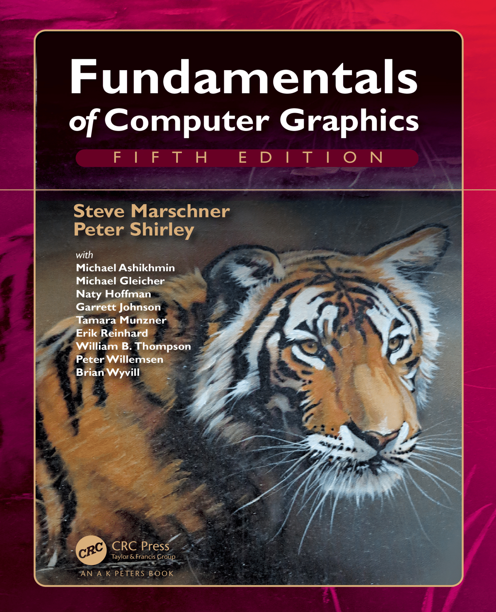

# FundamentalsOfComputerGraphics-CN

计算机图形学基础（中文译本）



## Introduction - 介绍

本仓库是《计算机图形学基础（第五版）》的中文翻译，支持mdbook和xelatex两种格式。

## Installation - 安装
###  dependence - 依赖
  - mdbook安装
```bash
# 从源码构建mdbook工具
cargo install mdbook
# 从源码构建最新版mdbook工具
cargo install --git https://github.com/rust-lang/mdBook.git mdbook
# mac系统使用homebrew安装mdbook工具
brew install mdbook
# Arch linux使用pacman包管理器安装mdbook工具
pacman -S mdbook
```
  - tex安装
```bash
# TeX Live安装
wget -c https://mirrors.tuna.tsinghua.edu.cn/CTAN/systems/texlive/Images/texlive2022-20220321.iso
# windows
# 1）解压iso文件
# 2）进入解压目录
./install-tl-windows.bat # 也可双击运行该批处理文件
# linux
mount ./texlive2022-20220321.iso /mnt
cd /mnt
perl install-tl # 或者./install-tl -gui

# MacTEX安装
# macOS
wget -c https://mirror.ctan.org/systems/mac/mactex/MacTeX.pkg
# 双击运行MacTeX.pkg
```
### repository - 存储库
```bash
# 克隆存储库
git@github.com:zouyonghe/FundamentalsOfComputerGraphics-CN.git
# 进入目录
cd FundamentalsOfComputerGraphics-CN
```

## Usage - 用法
- mdbook使用
```bash
# 在浏览器中打开图书
mdbook serve --open

# 构建图书
mdbook build
```
- xelatex使用
```bash
# 进入tex目录
cd tex
# 编译pdf图书
xelatex FundamentalsComputerGraphics.tex
```
## Changelog - 更新日志

| 章节 | 开始时间 | 结束时间 | 状态 | 译者 |
| :---: | :----: | :----: | :----: | :----: |
|第一章 | 2022.7.5 | 2022.7.10 | 已完成 |buding|
|第二章 | 2022.7.11 | - | 进行中 |buding|
|第三章 | - | - | 未开始 |-|
|第四章 | - | - | 未开始 |-|
|第五章 | - | - | 未开始 |-|
|第六章 | - | - | 未开始 |-|
|第七章 | - | - | 未开始 |-|
|第八章 | - | - | 未开始 |-|
|第九章 | - | - | 未开始 |-|
|第十章 | - | - | 未开始 |-|
|第十一章 | - | - | 未开始 |-|
|第十二章 | - | - | 未开始 |-|
|第十三章 | - | - | 未开始 |-|
|第十四章 | - | - | 未开始 |-|
|第十五章 | - | - | 未开始 |-|
|第十六章 | - | - | 未开始 |-|
|第十七章 | - | - | 未开始 |-|
|第十八章 | - | - | 未开始 |-|
|第十九章 | - | - | 未开始 |-|
|第二十章 | - | - | 未开始 |-|
|第二十一章 | - | - | 未开始 |-|
|第二十二章 | - | - | 未开始 |-|
|第二十三章 | - | - | 未开始 |-|


## FAQ - 常见问题

### 如何参与本书翻译？

因本书翻译工作量巨大，希望志同道合者共同参与。

尚需如下角色成员：
- 译者：完成书籍各章节翻译工作，使用markdown和latex进行本书翻译；
- 校对员：完成书籍各章节校对工作，从表述、排版等方面对译文进行审阅；
- 推广员：对本书的中文版进行推广，号召更多人加入本翻译项目或了解计算机图形学相关知识。

若您希望贡献，请首先fork本仓库，并在Issues中提出想要翻译的章节，请认真、耐心地进行翻译，力求用词准确、通俗易懂，并且文档格式符合标准，翻译完成后请发起PR，经审核后可合入主线，您的名字也将进入本书的译者列表。

### 发现书籍谬误，如何提出？

因为译者水平有限，在翻译的过程中出现疏漏、错误、语义不明等情况在所难免，如果在阅读的过程中遇到上述情况，烦请读者悉心指出，帮助译者订正。

- 请fork本仓库，对谬误部分进行订正，然后发起PR，经审核后可合入主线。
- 参见“联系”，向译者提出修改意见。

## Support - 支持

如需获取其他帮助，请在Issues提出问题，也可参照“联系”，获取帮助。

### Dos - 文档

[mdBook Documentation](https://rust-lang.github.io/mdBook/)

[计算机图形学基础-原版](./original/Shirley.FundamentalsComputerGraphics.pdf)

### Contact - 联系

🍮buding QQ：1259085392 EMAIL：1259085392z@gmail.com
QQ群：584041033（进群验证：计算机图形学基础）

## Authors and acknowledgment - 贡献者和感谢

感谢 [Steve Marschner](https://www.cs.cornell.edu/\~srm/)和[Peter Shirley](https://www.petershirley.com/)以及其他贡献者共同参与编写完成《计算机图形学基础》这部图形学巨著。
