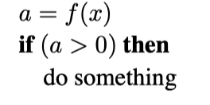

# 数值问题

&emsp;&emsp;许多图形程序实际上只是三维数字代码。数字问题在这类程序中往往是至关重要的。在 "过去"，要以稳健和可移植的方式处理这些问题是非常困难的，因为机器对数字有不同的内部表示，更糟糕的是，处理异常的方式也不尽相同，互不兼容。幸运的是，几乎所有的现代计算机都符合IEEE浮点数标准（IEEE标准协会，1985）。这允许程序员对处理某些数字条件做出许多方便的假设。

&emsp;&emsp;尽管IEEE浮点数具有很多在编码数值算法时很有价值的特性，但对于图形中遇到的大多数情况只有少数几个特性是至关重要的。首先，也是最重要的是要了解IEEE浮点数运算中实数的三个"特殊 "值。

1. 正无穷（∞）。这是一个比其他所有有效数字都大的有效数字。
1. 负无穷（-∞）。这是一个比其他所有有效数字都小的有效数字。
3. 非数字（NaN）。这是一个无效的数字，是由一个具有不确定后果的操作产生的，如0除以0。

&emsp;&emsp;IEEE浮点数的设计者做出了一些对程序员来说非常方便的决定。其中许多与上述三个处理异常的特殊值有关，比如除以零。在这些情况下，异常会被记录下来，但在很多情况下，程序员可以忽略它。具体来说，对于任何正实数a，以下涉及除以无穷数的规则都是成立的：

+a/(+∞) = +0,  
−a/(+∞) = −0,  
+a/(−∞) = −0,  
−a/(−∞) = +0.  

&emsp;&emsp;其他涉及无穷数的运算的行为与人们所期望的一样。同样对于正a，其行为如下：

∞ + ∞ = +∞,  
∞ − ∞ = NaN,   
∞ × ∞ = ∞,  
∞/∞ = NaN,  
∞/a = ∞,   
∞/0 = ∞,  
0/0 = NaN.

&emsp;&emsp;布尔表达式中涉及无穷数的规则与预期一致：  

1. 所有有限的有效数字都小于+∞。  
2. 所有有限的有效数字都大于-∞。  
3. -∞小于+∞。  

&emsp;&emsp;涉及NaN值的表达式规则比较简单：  

1. 任何包括NaN的算术表达式的结果都是NaN。
2. 任何涉及NaN的布尔表达式都是假的。

&emsp;&emsp;也许IEEE浮点数最有用的地方在于如何处理除以零的问题；对于任何正实数a，以下涉及除以零值的规则都成立：

+a/ +0 = +∞,

−a/ +0 = −∞.

&emsp;&emsp;如果程序员使用IEEE规则，那么许多数字计算会变得更加简单。例如，考虑表达式：

&emsp;&emsp;这种表达方式出现在电阻和透镜上。如果除以0会导致程序崩溃（在IEEE浮点数之前的许多系统中都是如此），那么就需要两个if语句来检查b或c的小值或零值。相反，在IEEE浮点数中，如果b或c为零，我们会如愿获得a的零值。另一种避免特殊检查的常用技术是利用NaN的布尔特性。请看下面的代码段：

在这里，函数f可能会返回 "丑陋 "的值，如∞或NaN，但if条件仍然是明确的：当a=NaN或a=-∞时为假，a=+∞为真。在决定返回哪些值时要小心，通常if可以做出正确的选择，而不需要特别的检查。这使得程序更小、更健壮、更高效。