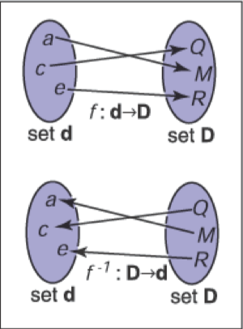
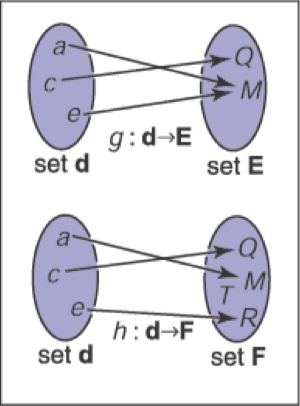
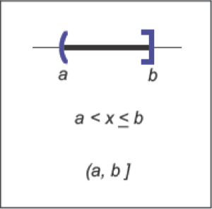

# 集合和映射

 

&emsp;&emsp;映射，也叫函数，是数学和编程的基础。像程序中的函数一样，数学中的映射需要同一个类型的参数，并将其映射到（返回）一个特定类型的对象。在程序中，我们说的是 "类型"；在数学中，我们要确定集合。当我们有一个对象是一个集合的成员时，我们使用∈符号。比如说，

a ∈ S，

可以理解为 "a是集合S的成员"。给定任何两个集合A和B，我们可以通过两个集合的笛卡尔积来创建第三个集合，表示为A×B。这个集合A×B由所有可能的有序对（a，b）组成，其中a∈A和b∈B。作为缩写，我们用符号A^2表示A×A。我们可以扩展笛卡尔积，从三个集合中创建一个所有可能的有序三元组集合，以此类推，从任意多的集合中创建任意长的有序元组。

&emsp;&emsp;常见的关注点包括：
- $\mathbb{R}$——实数；
- $\mathbb{R^+}$——非负实数（包括0）；
- $\mathbb{R}^2$——真实二维平面中的有序对；
- $\mathbb{R}^n$——n维迪卡尔空间中的点；
- $\mathbb{Z}$——整数；
- $S^2$——单位球面上的三维点（R^3中的点）的集合。

&emsp;&emsp;请注意，虽然S^2是由嵌入三维空间的点组成的，但它是在一个可以用两个变量进行参数化的表面上，所以它可以被认为是一个二维集合。对映射的记号使用箭头和冒号，例如，

$$
f : \mathbb{R} \mapsto \mathbb{Z},
$$

你可以把它理解为 "有一个叫做f的函数，它把一个实数作为输入，并把它映射成一个整数。" 这里，箭头前面的集合被称为函数的域，右边的集合被称为目标。计算机程序员可能更愿意使用下面等价的语句。"有一个叫f的函数，它有一个实数参数，返回一个整数"。换句话说，上面的集合符号等同于常见的编程符号：
$$
\text{integer} \  f(\text{real}) \leftarrow \text{equivalent} \rightarrow f : \mathbb{R} \mapsto \mathbb{Z}。
$$
因此，冒号符号可以被认为是一种编程语法。就是这么简单。

&emsp;&emsp;点f(a)被称为a的映像，一个集合A（定义域的子集）的映像是目标映像的子集，包含A中所有点的映像。整个定义域的映像被称为函数的值域。

## 逆向映射

&emsp;&emsp;如果我们有一个函数f : A->B，可能存在一个反函数f^-1 : B->A，它的定义是当b = f ( a )时，f^-1 ( b ) = a 。这个定义只有在每个b \in B都是f下某个点的图像（即范围等于目标），并且只有一个这样的点（即只有一个a，f(a)=b）时才有效。这样的映射或函数被称为双投。双投将每一个a E A映射到一个唯一的b E B，对于每一个b E B，正好有一个a E A，使f(a)=b（图2.1）。一组骑手和马匹之间的双射关系表明，每个人都骑着一匹马，每匹马都被骑着。这两个函数是骑手（马）和马（骑手），它们是彼此的反函数。不是双射的函数没有反函数（图2.2）。

**图2.1**：一个双射 $f$ 和反函数 $f^{-1}$。注意，$f^{-1}$也是一个双射。

**图2.2**：函数 $g$ 不具有反函数，因为$\textbf{d}$中的两个元素匹配到$\textbf{E}$中相同的元素。函数 $h$ 没有反函数因为$\textbf{F}$中的元素 $T$ 在$\textbf{d}$ 中没有匹配的元素。

&emsp;&emsp;一个双射的例子是 $f : \mathbb{R} \mapsto \mathbb{R}$，其中 $f(x) = x^3$。它的反函数为 $f^{-1}(x) = \sqrt[3]{x}$ 。这个例子表明，标准的符号可能有些笨拙，因为 $x$ 在 $f$ 和 $f^{-1}$ 中都被用作虚拟变量。有时使用不同的虚拟变量会更直观，$y = f(x)$，$x=f^{-1}(y)$。这就产生了更直观的 $y = x^3$ 和 $x = \sqrt[3]{y}$。一个没有反函数的例子是 $sqr : \mathbb{R} \mapsto \mathbb{R}$，其中 $sqr(x) = x^2$。它不具有反函数的原因包括两个：首先 $x^2 = (-x)^2$，其次域中没有成员映射到目标的负数部分。请注意，如果我们把域和范围限制在 $\mathbb{R^+}$，可以定义一个反函数。那么 $\sqrt{x}$ 是一个有效的反函数。

## 区间

&emsp;&emsp;通常情况下，我们希望指定一个函数处理的是数值受限的实数。这样的一个约束就是指定一个区间。区间的一个例子是零和一之间的实数，不包括零或一。我们把它表示为 $(0,1)$。因为它不包括其端点，所以被称为开区间。相应的闭区间，包含其端点，用方括号表示： $[ 0 , 1 ]$ 。这种符号可以混合使用；即 $[0,1)$ 包括零，但不包括一。当写一个区间 $[a,b]$ 时，我们假定 $a \leq b$。表示一个区间的三种常见方法如图2.3所示。区间的笛卡尔积经常被使用。例如，为了表示点 $x$ 在三维的单位立方体中，我们说$x \in [0, 1]^3$。

**图2.3**：三个表示等效方式用于表示区间从 $a$ 到 $b$，包含 $b$ 但不包含 $a$

&emsp;&emsp;区间在与集合运算的结合中特别有用：交集、并集和差集。例如，两个区间的交集是它们共同点的集合。符号 $\cap$ 用来表示交集。例如，$[3,5) \cap [4,6] = [4,5)$。而并集，使用符号 $\cup$ 用来表示任何一个区间内的点。例如，$[3,5) \cup [4,6] = [3,6]$。与前两个运算符不同，差集运算符根据参数顺序产生不同结果。减号用于差集运算，它返回左侧区间中不在右侧区间的点。例如，$[3,5) - [4,6] = [3,4]$，以及 $[4,6] - [3,5] = [5,6]$。这些操作用区间图特别容易直观地表现出来（图2.4）。

**图2.4**：在 $[3,5)$ 和 $[4,6]$ 上的区间操作

## 对数函数

&emsp;&emsp;虽然当前不像计算器出现之前那样普遍，但对数通常在具有指数项的方程问题中很有用。根据定义，每个对数都有一个底 $a$。以 $a$ 为底的对数 $x$ 通常被写作 $\log_ax$，并且它被定义为若要得到 $x$ 需要将 $a$ 乘幂的指数值。即，

$$y = \log_ax \iff a^y = x. $$

&emsp;&emsp;请注意，以 $a$ 为底数的对数和将 $a$ 乘幂的函数是互逆的。这个基本定义导致几个后果：

$$
\begin{aligned}
a^{\log_a(x)} &= x; \\
\log_a(a^x) &= x; \\
\log_a(xy) &= \log_ax+\log_ay; \\
\log_a(x/y) &= \log_ax-\log_ay; \\
\log_ax &= \log_ab\log_bx.
\end{aligned}
$$

&emsp;&emsp;当我们将微积分应用于对数时，经常会出现特殊数字 $e=2.718...$。以 $e$ 为底的对数被称为自然对数。我们采用常用的简写 $ln$ 来表示：

$$\ln x \equiv \log_ex.$$

&emsp;&emsp;请注意，“ $\equiv$ ”符号可以被理解为“根据定义恒等”。像 $\pi$ 一样，特殊数字 $e$ 出现在很多情况下。除了 $e$ 以外，在许多领域还使用特定的技术进行操作，并在其符号中省略基数，即 $\log x$。例如，天文学家经常使用以十为底，理论计算机科学家经常使用以二为底。由于计算机图形学借鉴了许多领域的技术，我们将避免这种缩写。

&emsp;&emsp;对数和指数的导数阐明了为什么自然对数是“自然的”：

$$
\begin{aligned}
\frac{d}{d x} \log _{a} x &=\frac{1}{x \ln a} \\
\frac{d}{d x} a^{x} &=a^{x} \ln a
\end{aligned}
$$

&emsp;&emsp;上面的常数乘数只有在 $a = e$ 时才是是统一的。