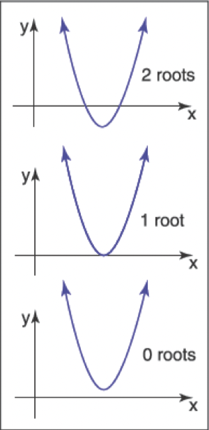

# 求解二次方程

&emsp;&emsp;一个二次方程满足如下格式

$$Ax^2+Bx+C=0,$$

&emsp;&emsp;其中 $x$ 是一个未知的实数，并且 $A$、$B$ 和 $C$ 是已知的常数。如果你想到 $y=Ax^2+Bx+y$ 的二维 $xy$ 图，那么解就是任何 $x$ 值在 $y$ 中的“零交叉”。因为 $y=Ax^2+Bx+y$ 是一条抛物线，根据抛物线是否未相交、相切或相交于 $x$ 轴，将有零个、一个或两个实数解（图2.5）。

**图2.5**：二次方程根的几何解释是抛物线与 $x$ 轴的交点。

&emsp;&emsp;为了分析解决一元二次方程，我们先除以A：

$$x^2+\frac{B}{A} x+\frac{C}{A}=0$$

&emsp;&emsp;然后，我们“完成平方”来分组：

$$\left(x+\frac{B}{2 A}\right)^{2}-\frac{B^{2}}{4 A^{2}}+\frac{C}{A}=0$$

&emsp;&emsp;将常数部分移到右边，然后取平方根，得到：

$$
x+\frac{B}{2 A}=\pm \sqrt{\frac{B^{2}}{4 A^{2}}-\frac{C}{A}} .
$$

&emsp;&emsp;从两边减去 $\frac{B}{2 A}$，然后用分母 $2A$ 分组，就得到了我们熟悉的形式[^1]:

[^1]:一个稳健的实现将使用等价表达式 $2 C /\left(-B \mp \sqrt{B^{2}-4 A C}\right)$ 来计算其中一个根，这取决于B的符号（练习7）。

$$
\begin{equation} x=\frac{-B \pm \sqrt{B^{2}-4 A C}}{2 A} . \end{equation}
$$

&emsp;&emsp;这里，“$\pm$”符号意味着有两个解决方案，一个是正号，一个是负号。因此，$3\pm1$ 等于 “两个或四个”。请注意，决定解数量的项是：

$$
D \equiv B^{2}-4 A C
$$

&emsp;&emsp;这被称为二次方程的判别式。如果 $D>0$，有两个实数解（也叫根）。如果 $D=0$，有一个实数解（一个“双根”）。如果 $D<0$，没有实数解。

&emsp;&emsp;例如，$2x^2+6x+4=0$ 的根是 $x=-1$ 和 $x=-2$，方程 $x^2+x+1=0$ 没有实解。这些方程的判别式分别是 $D=4$ 和 $D=-3$，分别地，我们预期得到了解的数量。在程序中，通常先评估 $D$，如果 $D$ 为负数，则返回“无根”而不取平方根，这是一个好的思路。
