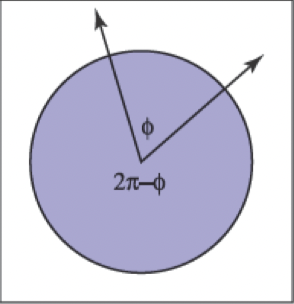
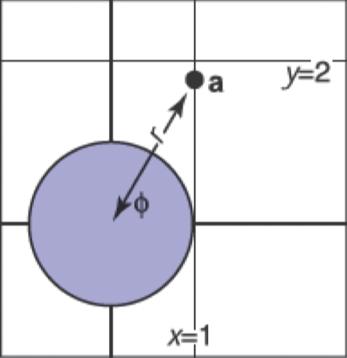
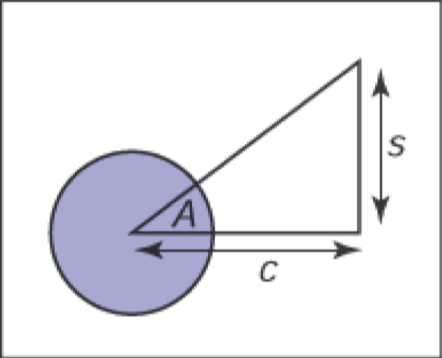
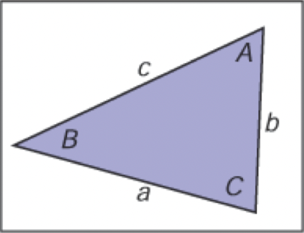

# 三角函数

&emsp;&emsp;在图形学中，我们在许多情况下使用基本三角函数。通常情况下，它不怎么花哨，但是经常有助于记住基本定义。

## 角度

&emsp;&emsp;尽管我们认为角度是理所当然的，但我们应该回到它们的定义，以便我们可以将角度的概念延伸到球体上。角度是在两条半线（从原点出发的无限射线）或方向之间形成的，并且必须用一些约定来决定它们之间产生的角度的两种可能性，如图2.6所示。角度是由它在单位圆上切出的弧段的长度来定义的。一个常见的约定是使用较小的弧长，角的符号由指定两条半线的顺序来决定。使用该约定，所有角度都在 \\([-\pi, \pi]\\) 范围内。

**图2.6**：两条半线将单位圆切割成两条弧。任意一条弧线的长度都是这两条半线“之间”的有效角度。我们可以使用较小长度是角度的约定，或者两条半线按一定顺序指定，确定角度 \\(\phi\\) 的弧是从第一条半线到第二条半线逆时针扫过的弧。

&emsp;&emsp;这些角度中的每一个都是被两个方向“切割”的单位圆的弧长。因为单位圆的边缘是 \\(2\pi\\)，所以两个可能的角度总和为 \\(2\pi\\)。这些弧长的单位是弧度。另一个常见的单位是度数，圆的周长是 \\(360^\circ\\)。因此，一个弧度为 \\(\pi\\) 的角的度度是 \\(180^\circ\\)，通常表示为 \\(180^\circ\\)。度数和弧度之间的转换是

Degrees =\frac{180}{\pi} radians;\\\\
Radians =\frac{\pi}{180} degrees.
\\]

## 三角函数

&emsp;&emsp;给出一个边长为 \\(a\\)、\\(o\\)、\\(h\\) 的直角三角形，其中 \\(h\\) 是最长边的长度（总是与直角相对），或叫斜边，勾股定理描述了一种重要的关系：

\\[
a^2+o^2=h^2
\\]

&emsp;&emsp;你可以从图2.7中看到这一点，大正方形的面积为 \\((a+o)^2\\)，四个三角形的面积合计为 \\(2a0\\)，中心正方形的面积为 \\(h^2\\)。

**图2.7**：勾股定理的几何证明。

&emsp;&emsp;由于三角形和内部方块均匀地细分了较大的正方形，所以我们可以很容易地取得如下形式 \\(2ao+h^2=(a+o)^2\\)。我们定义了 \\(\phi\\)，以及其他基于比值的三角表达式：

\\[
\begin{aligned}
\sin \phi & \equiv o / h \\\\
\csc \phi & \equiv h / o \\\\
\cos \phi & \equiv a / h \\\\
\sec \phi & \equiv h / a \\\\
\tan \phi & \equiv o / a \\\\
\cot \phi & \equiv a / o
\end{aligned}
\\]

&emsp;&emsp;这些定义允许我们建立极坐标，其中一个点被编码为与原点的距离与 \\(x\\) 正半轴带符号的角度（图2.8）。请注意，角度的范围是 \\(\phi\in(-\pi,\pi]\\)，正数角是从 \\(x\\) 轴正半轴逆时针方向旋转取得的。逆时针方向映射到正数的这个约定是任意的，但它被应用于图形学很多场景中，因此值得将其记忆。

**图2.8**：点 \\((x_a,y_a)\\) 的极坐标为 \\((r_a,\phi_a)=(2,\frac{\pi}{3})\\)。

&emsp;&emsp;三角函数是周期性的，可以接受任何角度作为参数。例如，\\(\sin(A) = \sin(A + 2\pi)\\)。这意味着当与 \\(\mathbb{R}\\) 域考虑时，这些函数是不可逆的。这个问题可以通过限制标准反函数的范围来避免。这在几乎所有现代数学库中都是以标准方式进行的（例如，Plauger（1991））。域和范围是

\\[
\begin{equation}
\begin{aligned}
&\operatorname{asin}:[-1,1] \mapsto[-\pi / 2, \pi / 2] \\\\
&\operatorname{acos}:[-1,1] \mapsto[0, \pi] \\\\
&\operatorname{atan}: \mathbb{R} \mapsto[-\pi / 2, \pi / 2] \\\\
&\operatorname{atan} 2: \mathbb{R}^{2} \mapsto[-\pi, \pi]
\end{aligned}
\end{equation}
\\]

&emsp;&emsp;最后一个函数 \\(\operatorname{atan} 2(s,c)\\) 通常非常有用。它采用与 \\(\sin A\\) 成比例的 \\(s\\) 值以及与 \\(\cos A\\) 成比例的 \\(c\\) 值，两者具有相同的因子，最后返回 \\(A\\)。假定因子为正数。一种看法是它返回了二维笛卡尔点 \\((c,s)\\) 在极坐标中的角度（图2.9）。

**图2.9**：函数 \\(\operatorname{atan} 2(s,c)\\) 返回 \\(A\\) 的角度，这通常在图形学中非常有用。

## 有用的恒等式

&emsp;&emsp;本节未经推导列出了各种有用的三角恒等式。

&emsp;&emsp;转换恒等式：

\\[
\begin{aligned}
\sin (-A) &=-\sin A \\\\
\cos (-A) &=\cos A \\\\
\tan (-A) &=-\tan A \\\\
\sin (\pi / 2-A) &=\cos A \\\\
\cos (\pi / 2-A) &=\sin A \\\\
\tan (\pi / 2-A) &=\cot A
\end{aligned}
\\]

&emsp;&emsp;毕达哥拉斯恒等式：

\\[
\begin{array}{r}
\sin ^{2} A+\cos ^{2} A=1 \\\\
\sec ^{2} A-\tan ^{2} A=1 \\\\
\csc ^{2} A-\cot ^{2} A=1
\end{array}
\\]

&emsp;&emsp;加减法恒等式：

\\[
\begin{aligned}
\sin (A+B) &=\sin A \cos B+\sin B \cos A \\\\
\sin (A-B) &=\sin A \cos B-\sin B \cos A \\\\
\sin (2 A) &=2 \sin A \cos A \\\\
\cos (A+B) &=\cos A \cos B-\sin A \sin B \\\\
\cos (A-B) &=\cos A \cos B+\sin A \sin B \\\\
\cos (2 A) &=\cos ^{2} A-\sin ^{2} A
\end{aligned}
\\(\\)

\\]
\begin{aligned}
\tan (A+B) &=\frac{\tan A+\tan _{B}}{1-\tan A \tan B} \\\\
\tan (A-B) &=\frac{\tan A-\tan B}{1+\tan A \tan B} \\\\
\tan (2 A) &=\frac{2 \tan A}{1-\tan A}
\end{aligned}
\\[

&emsp;&emsp;半角恒等式：

\\]
\begin{aligned}
&\sin ^{2}(A / 2)=(1-\cos A) / 2 \\\\
&\cos ^{2}(A / 2)=(1+\cos A) / 2
\end{aligned}
\\[

&emsp;&emsp;乘法恒等式：

\\]
\begin{aligned}
&\sin A \sin B=-(\cos (A+B)-\cos (A-B)) / 2 \\\\
&\sin A \cos B=(\sin (A+B)+\sin (A-B)) / 2 \\\\
&\cos A \cos B=(\cos (A+B)+\cos (A-B)) / 2
\end{aligned}
\\(\\)

&emsp;&emsp;以下恒等式适用于边长为 \\(a\\)、\\(b\\) 和 \\(c\\) 的任意三角形，每边相对的角度分别为 A、B、C（图 2.10），

**图2.10**：几何的三角定律。

\\[
\begin{aligned}
\frac{\sin A}{a}=\frac{\sin B}{b}=\frac{\sin C}{c}\quad &\mbox{（正弦定理）}\\\\
c^{2}=a^{2}+b^{2}-2 a b \cos C\quad &\mbox{（余弦定律）}\\\\
\frac{a+b}{a-b}=\frac{\tan \left(\frac{A+B}{2}\right)}{\tan \left(\frac{A-B}{2}\right)}\quad &\mbox{（切线定律）}
\end{aligned}
\\]

&emsp;&emsp;三角形的面积也可以根据这些边长计算：

\\[
\text { Triangle area }=\frac{1}{4} \sqrt{(a+b+c)(-a+b+c)(a-b+c)(a+b-c)} .
\\]