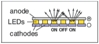
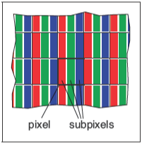
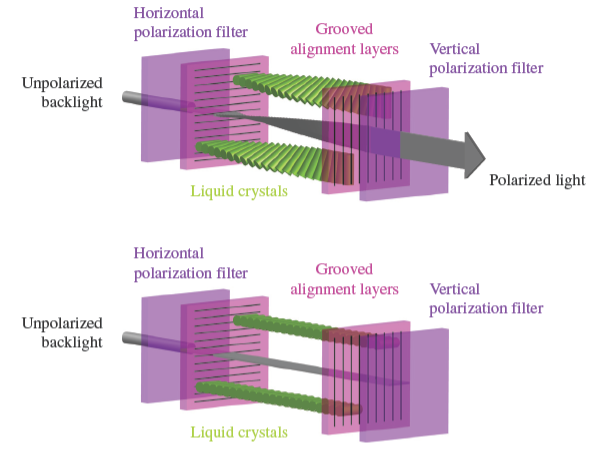
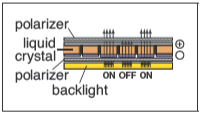
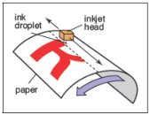
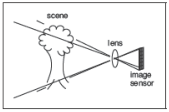
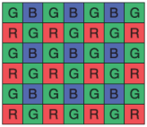
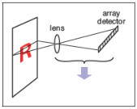

# 光栅设备

&emsp;&emsp;在讨论抽象的光栅图像之前，了解使用这些图像的一些具体设备的基本操作是很有意义的。一些熟悉的光栅设备可以被归入一个简单的层次结构中：

* 输出
  * 显示器
    * 透射式显示器：液晶显示器（LCD）
    * 自发光式显示器：发光二极管（LED）显示器
  * 打印
    * 二值图像：喷墨打印机
    * 连续色调（continuous-tone）图像：热升华打印机
* 输入
  * 二维阵列传感器：数码相机
  * 一维阵列传感器：平板扫描仪

## 显示器

&emsp;&emsp;目前的显示器，包括电视和数字电影放映机以及计算机显示器和投影仪，几乎普遍基于固定的像素阵列。它们可以分为自发光式显示器，它使用直接发射可控光量的像素，和透射式显示器，其中像素本身不发光，而是改变它们允许通过的光量。透射式显示器需要光源来照亮它们：在直视型显示器中，光源是阵列后面的背光;在投影仪中，光源是一盏灯，它发出的光穿过阵列后投射到屏幕上。而自发光式显示器便是其自身的光源。

&emsp;&emsp;发光二极管（LED）显示器是自发光式显示器的一个例子。每个像素由一个或多个LED组成，这是一种基于通过电流强度决定发光亮度的半导体设备（基于有机/无机半导体）（图3.1）。

**图3.1：** 发光二极管（LED）显示器的运行机制。

**图3.2：** 组成平板显示器中单个像素的红、绿、蓝子像素。

&emsp;&emsp;彩色显示器上的像素被细分为3个独立控制的子像素，一个红色、一个绿色、一个蓝色，每个LED都由不同材料组成从而发出不同颜色的光（图3.2）。当从一定距离外观看显示器时，眼睛无法分开每个独立的子像素，最后感知到的颜色便是红、绿、蓝三色混合成的颜色。

&emsp;&emsp;液晶显示器（LCD）是透射式显示器的一个例子。液晶是一种材料，其分子结构使其能够旋转通过它的光的偏振，并且旋转的程度可以通过施加的电压来调节。LCD像素（图3.3）后面有一层偏振膜，因此它被偏振光照亮——让我们假设光是水平偏振的。

**图3.3：** 上图是一个处于开启状态的LCD显示器像素，其中液晶单元旋转光线的偏振方向，因此光线能通过前端偏振片。下图是一个处于关闭状态的LCD显示器像素，其中前端偏振片阻挡了所有通过后端偏光片的光线。图由Reinhard, Khan, Akyilz and Johnson(2008)提供。

&emsp;&emsp;像素前的第二层偏振膜只传导垂直偏振光。如果液晶层两端施加电压至不改变偏振方向，则所有光都被阻挡且像素处于“关闭”状态（最小光强度）。如果电压被设置以让液晶层改变偏振方向至90度，则所有从像素后方进入的光都将从前端逃离，此时像素处于完全“开启”状态（具有最大光强度）。 而中等的电压会部分旋转偏振角度，这样前端偏振片会阻挡部分光线，最终产生的光强度介于最大值与最小值之间（图3.4）。就像彩色LED显示器一样，彩色LCD显示器的像素中也包含红、绿、蓝子像素，实质上是三个独立的、覆盖有红、绿、蓝三种颜色过滤器的像素。

**图3.4：** 液晶显示器（LCD）的运行机制。

&emsp;&emsp;任何形式的有固定像素阵列的显示器——包括以上这些或其他技术——都有一个由阵列大小决定的基础的固定分辨率。对于显示器或图像，分辨率仅仅意味着像素阵列的尺寸：如果桌面显示器有1920*1200的分辨率，那么它总共有2304000个像素分布在1920列和1200行的像素阵列中[^1]。

[^1]:显示器的分辨率有时被叫做“本地分辨率”因为许多显示器都可以通过内置转换处理其他分辨率的图片。

## 打印设备

&emsp;&emsp;在纸上永久记录图像的过程与在显示器上短暂地显示图片相比有许多限制。在印刷中，颜料被分布于纸上或其他打印媒介上，当光从纸上反射后便能形成想要的图案。打印机是类似于显示器的光栅设备，但许多打印机只能打印二值图像，即每个网格位置要么沉积颜料，要么不沉积，没有可能的中间值。

**图3.5：** 喷墨打印机的运行机制。

&emsp;&emsp;喷墨打印机（图3.5）是一种通过扫描形成光栅图像的设备。喷墨打印头容纳了含有颜料的液体墨水，并能通过电子控制将墨水以微小墨滴的形式喷出。喷墨头在纸上横向移动，当它经过应该接受墨水网格位置时便会将墨滴喷射出；想要保持空白的位置则不会喷射墨滴。喷墨头每次扫描（sweep）之后，纸张都会略微前移，随后网格的下一行被喷射到纸上。彩色打印机使用数个打印头，每个喷头喷射一种不同的颜色的墨水，因此每个网格位置可接受任何由不同颜色的墨滴混合成的颜色。由于所有墨滴都一样，一台打印二值图像的喷墨打印机在每个网格格点上要么有墨滴要么没有墨滴，没有中间的色度（shade）。

&emsp;&emsp;喷墨打印机没有物理像素阵列，其分辨率由墨滴的尺寸以及喷墨头每次扫描后纸张前进的距离决定。许多喷墨打印机的打印头中有多个喷嘴，允许其在一次横向移动中完成多次扫描，但最终是由纸张前移距离决定行距而非喷嘴间距[^2]。

[^2]:也存在连续喷墨打印机，它以连续的螺旋路径打印包裹在旋转的滚筒周围的纸张，而不是来回移动打印头。

**图3.6：** 热敏染料转印打印机的运行机制。

&emsp;&emsp;热敏染料转印工艺是连续色调印刷工艺的一个例子，这意味着可以在每个像素上沉积不同量的染料 - 它不像喷墨打印机那样全有或全无（图3.6）。将含有彩色染料的供体色带压在纸张（或染料接收器）与包含加热组件线性阵列的打印头之间，图片的每列像素分配一个加热组件。当纸张和色带经过打印头时，加热组件通过打开和关闭状态来在需要染料的区域加热色带，使染料从色带扩散到纸张。对几种染料中的每一种重复此过程。由于较高的温度会导致更多的染料被转印，因此可以控制在每个网格位置沉积的每种染料的量，从而产生连续的颜色范围。打印头中加热组件的数量在页面横向方向上确定了固定的分辨率，但沿页面的分辨率由加热、冷却速率与纸张速度的关系决定。

&emsp;&emsp;与显示器不同，打印机的分辨率是根据像素密度而不是像素总数来描述的。因此，如果热敏染料转印打印机的打印头上每英寸有300个像素，则其整个页面的分辨率为300像素每英寸（ppi）。如果选择沿页面的分辨率相同，我们可以简单地说打印机的分辨率为300ppi。将点放在每英寸 1200 个网格点上的喷墨打印机被描述为分辨率为每英寸1200个点（dpi）。由于喷墨打印机是二值设备，因此至少出于两个原因，它需要更精细的网格。由于边缘是突兀的黑/白边界，因此需要非常高的分辨率来避免出现锯齿（stair-stepping/aliasing）（详见第9.3节）。打印连续色调图像时，需要高分辨率通过打印称为半色调的不同密度点图案来模拟中间色[^3]。

[^3]:术语“DPI”经常被用于表达“PPI”的含义，但“DPI”应被用于涉及二值设备的情况，而“PPI”应被用于涉及连续色调设备的情况。

## 输入设备

&emsp;&emsp;光栅图像不能凭空产生，并且任何不是由算法产生的图像都需要通过光栅输入设备记录（通常是相机或扫描仪）。即使是3D场景渲染而成的图像也通常使用照片作为纹理映射（详见第11章）。光栅输入设备需要对每个像素进行光记录，并且（就像输出设备一样）它们通常基于传感器阵列。

&emsp;&emsp;数码相机就是一种二维阵列输入设备。相机中的图像传感器是一个拥有光敏像素网格的半导体设备。两种常见的阵列类型是电荷耦合元件（CCDs, charge-coupled devices）和互补金属氧化物半导体（CMOS, complimentary metal-oxide-semiconductor）图像传感器。相机的镜头将要被照相的景物的图片传感器上，然后每个像素记录落在其上的光能，最终产生构成输出图像的数字（图3.7）。就像颜色通过红、绿、蓝子像素进行显示一样，许多相机通过使用“色彩滤镜阵列”（color-filter array）或“马赛克”（mosaic）来让每个像素只能感知红光、绿光或蓝光，而图像处理软件则在称为“去马赛克”（demosaicking）的过程中填充缺失值（图3.8）。

**图3.7：** 数码相机的运行机制。

**图3.8：** 许多彩色数字相机使用类似于上图所示的“拜尔马赛克”（Bayer mosaic）的色彩滤镜阵列。每个像素记录红光、绿光或蓝光。

&emsp;&emsp;其他相机使用3个独立阵列或阵列中的3个独立层级来在每个像素上记录独立的红、绿、蓝值，直接产生可用的彩色图片而无需更进一步地处理。相机分辨率由阵列中像素的固定数量决定，并且通常被描述为像素总数：一台阵列有3000列和2000行的相机产生分辨率3000*2000的图像，其中有六百万像素，称为“6兆像素”（MP, megapixel）相机。需要注意马赛克传感器并不记录一幅完整的图像，因此记录相同像素数但具有独立红色、绿色和蓝色记录值的相机比使用马赛克传感器的相机记录更多有关图像的信息[^4]。

[^4]:买相机的人通常使用兆（mega）来表示\\(10^6\\)，而不是兆字节（megabytes）代表的数量级\\(2^{20}\\)。

&emsp;&emsp;平板扫描仪也记录每个像素网格的红色、绿色和蓝色值。但与热敏染料转印打印机一样，它使用一维阵列横扫正在被扫描的页面，每秒进行多次记录（图3.9）。页面的横向分辨率由阵列的尺寸确定，并且页面的纵向分辨率由记录频率和扫描头移动的速度确定。彩色扫描仪具有 \\(3\times n_x\\) 阵列，其中\\(n_x\\)是页面的横向像素数，包括三行由红色、绿色和蓝色滤镜覆盖（的子像素）。在记录三种颜色的时间之间有适当的延迟，这允许在每个网格点进行三个独立的颜色记录。与连续色调打印机一样，扫描仪的分辨率以每英寸像素数 （ppi） 为单位进行报告[^5]。

[^5]:由于许多扫描仪可以通过内置转换产生其他分辨率的图像，扫描仪的分辨率有时被称为“光学分辨率”。

&emsp;&emsp;有了这些关于我们的图像来自哪里以及它们将去哪里的具体信息，我们现在将更抽象地讨论图像，就像我们在图形算法中使用它们一样。

**图3.9：** 平板扫描仪的运行机制。
