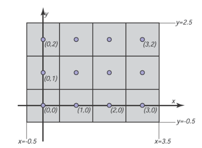

# 图像、像素和几何

&emsp;&emsp;我们知道光栅图像是一个大的像素阵列，每个像素都存储了图像在该网格点的信息。我们也看到了数种输出设备如何处理我们发给它的图像，以及输入设备如何从物理世界中由光形成的图像中获取它们。但是对于计算机中的计算，我们需要一个独立于任何设备细节的方便抽象，我们可以用它来推理如何生成或解释存储在图像中的值。

&emsp;&emsp;当我们记录或再现图像时，它们采取光能的二维分布的形式：显示器发出的光作为位置在显示器表面上的函数；落在相机图像传感器上的光作为传感器平面上位置的函数;反射率（reflectance），或反射光的分数（相对于吸收的），作为一张纸上位置的函数。因此，在物理世界中，图像是在二维区域（几乎总是矩形）上定义的函数。因此，我们可以将图像抽象为函数[^1]

[^1]:“像素不是小正方形！”  ——Alvy Ray Smith（1995）

\\[
  \begin{aligned}
  I(x,y):R\rightarrow V,
  \end{aligned}
\\]

&emsp;&emsp;其中\\(R\subset \mathbb{R} ^2\\)是一个矩形区域，而\\(V\\)是一个可能像素值的集合。最简单的例子是一个理想化的灰度图像，其矩形中的每个点只有亮度（而不是颜色），因此我们可以说\\(V=\mathbb{R}^{+}\\)（非负实数）。一幅理想化的彩色图像，每个像素都有红色、绿色、蓝色值，有\\(V=(\mathbb{R}^{+})^3\\)。我们将在下一小节讨论\\(V\\)的其他可能性[^2]。

[^2]:有没有其他不是矩形的光栅设备？

&emsp;&emsp;光栅图像与连续图像的这个抽象概念有什么关系？从具体的例子来看，照相机或扫描仪的一个像素是对该像素周围某个小区域的图像平均颜色的记录。一个具有红、绿、蓝子像素的显示器像素被设计成图像在像素面上的平均颜色由光栅图像中的相应像素值控制。在这两种情况下，像素值是图像颜色的局部平均值，它被称为图像的点样本。换句话说，当我们找到一个像素的值\\(x\\)时，它意味着“这个网格点附近的图像的值是\\(x\\)”。 图像作为函数的采样表示的想法将在第十章中进一步探讨。

**图3.10：** 一个拥有4个像素*3个像素的屏幕的坐标系。注意在部分API中\\(y\\)轴会指向下方。

&emsp;&emsp;一个平淡但重要的问题是像素在二维平面内如何定位。这只是一个约定俗成的问题，但创建一个一致的约定很重要！在本书中，光栅图像由一对\\((i，j)\\)索引，指示像素的列\\((i)\\)和行\\((j)\\)，从左下角开始计数。如果图像具有\\(n_x\\)列、\\(n_y\\)行像素，则左下角的像素为\\((0,0)\\)，右上角为像素\\((n_x-1,n_y-1)\\)。我们需要二维实际屏幕坐标来指定像素位置。我们将像素的采样点放置在整数坐标处，如图3.10中的4 x 3屏幕所示[^3]。

[^3]:在一些API和许多文件格式中，图片的行从上到下组织，因此\\((0,0)\\)点在左上角。这是由于历史原因：模拟电视广播的行就是从顶端开始。

&emsp;&emsp;图像的矩形区域具有宽度\\(n_x\\)和高度\\(n_y\\)，并且以此网格为中心，这意味着它延伸到每侧的最后一个采样点之外半个像素。所以\\(n_x \times n_y\\)图像的矩形域是：

\\[
  \begin{aligned}
  R=[-0.5,n_x-0.5]\times [-0.5,n_y-0.5].
  \end{aligned}
\\]

&emsp;&emsp;同样，这些坐标只是约定，但稍后在实现相机和视图变换时记住它们非常重要[^4]。

[^4]:一些系统将坐标系移动了半个像素，以将采样点放置在整数之间的中间位置、将图像边缘放置在整数上。

## 像素值

&emsp;&emsp;到目前为止，我们已经用实数描述了像素的值，表示图像中某个点的强度（可能分别用于表示红色，绿色和蓝色）。这表明图像应该是一个由浮点数组成的阵列，其中每个像素存储一个（对于灰度或黑白图像）或三个（对于RGB彩色图像）32位浮点数。当需要其精度和值范围时，有时会使用这种格式，但是图像具有大量的像素，并且用于存储和传输图像的内存和带宽总是稀缺的。在这种格式下，仅一张1000万像素的照片就会消耗大约115MB的RAM[^5]。

[^5]:为什么是115MB而不是120MB？

&emsp;&emsp;对于要直接显示的图像，需要的范围更小。虽然可能的光强度范围原则上是无限制的，但任何给定的设备都有一个明确的最大强度，所以在许多情况下，像素有一个有边界的范围是完全足够的，为了简单起见，通常取值为\\([0,1]\\)。例如，8位图像的可能值是O，1/255，2/255，……，254/255，1。用浮点数存储的图像，允许很大的数值范围，通常被称为高动态范围（HDR）图像，以区别于固定范围或用整数存储的低动态范围（LDR）图像。关于高动态范围图像的技术和应用的深入讨论，详见第20章[^6]。

[^6]:分母是255而非256，这很不雅观，但能准确表示0和1是很重要的。

&emsp;&emsp;此处有一些像素格式以及它们的代表性应用：

* 1位灰度图像——文本和其他不需要中间灰度的图像（需要高分辨率）
* 8位RGB固定范围颜色（每个像素24位）——网络和电子邮件应用，消费者照片
* 8或10位固定范围RGB（每个像素24位或30位）——到计算机显示器的数码接口
* 12-14位固定范围RGB（每个像素36-42位）——专业摄影的原始相机图像
* 16位固定范围RGB（每个像素48位）——专业摄影与打印；用于固定范围图像处理的中间格式
* 16位固定范围灰度图像（每个像素16位）——放射学和医学图像
* 16位“半精度”浮点RGB——HDR图像；实时渲染的中间格式
* 32位浮点RGB——通用目的中间格式，用于HDR图像的软件渲染和处理。

&emsp;&emsp;减少用于存储每个像素的位数会导致图像中出现两种不同的伪影（artifact）类型（或人为引入的缺陷）。一、用固定范围的值对图像进行编码会产生裁剪（clipping），当其他比最大值更亮的像素被设置或裁剪为最大可表示的值。例如，一张阳光明媚的景物照片可能包括比白色表面亮得多的再反射；当图像被转换为固定范围显示时，这些反射会被剪掉（即使它们是由相机测量的）。第二，以有限的精度对图像进行编码会导致量化的伪影（quantization artifact），或带状现象（banding），当需要将像素值四舍五入到最接近的可表示值时，就会在强度或颜色上出现明显的跳跃。带状现象在动画和视频中特别隐蔽，在静止的图像中带状现象可能并不令人讨厌，但当它们来回移动时就变得非常明显。

## 显示器强度与伽马（Gamma）

&emsp;&emsp;所有的现代显示器都是使用数字输入作为一个像素的“值”，并将其转换为一个强度等级。真正的显示器在关闭时有一些非零强度，因为屏幕会反射一些光线。为了我们的目的，我们可以认为这是 "黑色"，而显示器完全打开则是 "白色"。我们假设对像素颜色的数字描述从0到1不等。黑色是0，白色是1，介于黑色和白色之间的灰色是0.5。请注意，这里的 "一半 "指的是来自像素的物理光量，而不是外观。人类对强度的感知是非线性的，这不会成为本讨论的一部分；更多内容详见第19章。

&emsp;&emsp;要在显示器上产生正确的图像，有两个关键问题必须了解。第一个问题是，显示器对于输入是非线性的。例如，如果你给显示器的三个像素输入0、0.5和1.0，显示的强度可能是0、0.25和1.0（关闭、四分之一全开和全开）。作为这种非线性的近似描述，显示器通常以\\(\gamma \\)（"gamma"）值为特征。这个值是下面公式中的自由度：

\\[
\begin{align}
  \mbox{显示强度}=\mbox{（最大强度）}a^\gamma
\end{align}
\\]

&emsp;&emsp;其中\\(a\\)是介于0和1之间的输入像素值。比如，如果一台显示器有2.0的伽马值，并且我们输入\\(a=0.5\\)，则显示强度是四分之一最大可能强度（因为\\(0.5^2=0.25\\)）。注意\\(a=0\\)映射到0强度、\\(a=1\\)映射到与\\(\gamma\\)值无关的最大强度。使用\\(\gamma\\)描述显示器的非线性度只是一个近似值；我们不需要很高的精度来估计设备的\\(\gamma\\)精度。衡量非线性度的一个很好的视觉方法是找到能产生介于黑白之间的中间强度的\\(a\\)值。这个\\(a\\)会如下所示：

\\[
  \begin{aligned}
  0.5 = a^\gamma 
  \end{aligned}
\\]

&emsp;&emsp;如果我们能找到这样一个\\(a\\)，就能通过在两边取对数来推断出\\(\gamma\\)：

\\[
  \begin{aligned}
  \gamma = \frac{\ln 0.5}{\ln a}
  \end{aligned}
\\]

&emsp;&emsp;我们可以通过一个标准技术找到这个\\(a\\)，即在“输入\\(a\\)”的灰色像素正方形旁边显示一个黑白像素的棋盘图案（图3.11），然后要求用户调整\\(a\\)（例如用滑块），直到两边的平均亮度一致。当你从远处看这幅图时（如果你是近视眼，也可以不戴眼镜），当\\(a\\)产生的中间强度介于黑色和白色之间时，图的两边看起来差不多。这是因为模糊的棋盘混合了偶数的白色和黑色像素，所以整体效果是介于白色和黑色之间的统一颜色。

**图3.11：** 交替的黑、白像素在一段距离外看是介于黑色、白色之间的中间值。显示器的伽马值可通过找到一个看起来与黑白图案有相同强度的灰色值来推断出来。

&emsp;&emsp;一旦我们知道了\\(\gamma\\)，我们就可以对我们的输入进行伽马校正gamma correct），使\\(a=0.5\\)的值在显示时具有介于黑与白之间的中间强度。这是通过如下转换实现的;

\\[
  \begin{aligned}
  a^{'} = a^{\frac{1}{\gamma } }
  \end{aligned}
\\]

&emsp;&emsp;当把以上公式代入等式3.1，我们得到了[^7]：

\\[
  \begin{aligned}
  \mbox{显示强度} = (a^{'})^\gamma = (a^{\frac{1}{\gamma}})\mbox{（最大强度）} = a\mbox{（最大强度）}
  \end{aligned}
\\]

[^7]:使用模拟接口的显示器在水平方向上更难迅速改变强度，因此水平黑白线的效果比棋盘格更好。

&emsp;&emsp;实数显示器的另一个重要特征是，它们采取量化的输入值。因此，虽然我们可以在浮点范围\\([0,1]\\)内操作强度，但显示器的详细输入是一个固定大小的整数。这个整数最常见的范围是0-255，可以用8比特的存储空间来保存。这意味着\\(a\\)的可用值不是\\([O,1]\\)中的任何数值，而是：

\\[
  \begin{aligned}
  \mbox{a的可能值} = \lbrace \frac{0}{255},\frac{1}{255},\frac{2}{255},……,\frac{254}{255},\frac{255}{255} \rbrace
  \end{aligned}
\\]

&emsp;&emsp;这意味着可能的显示强度值近似于以下值：

\\[
  \begin{aligned}
    \lbrace M(\frac{0}{255})^\gamma ,M(\frac{1}{255})^\gamma ,M(\frac{2}{255})^\gamma ,……,M(\frac{254}{255})^\gamma ,M(\frac{255}{255})^\gamma \rbrace
  \end{aligned}
\\]

&emsp;&emsp;其中\\(M\\)是最大强度。在需要控制确切强度的应用中，我们必须实际测量256种可能的强度，并且这些强度在屏幕上的不同点可能不同，特别是对于CRT设备。它们也可能随视角而变化。幸运的是，很少有应用需要如此精确的校准。
