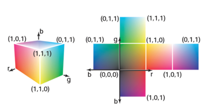

# RGB颜色

&emsp;&emsp;大多数计算机图形图像是根据红-绿-蓝（RGB）颜色定义的。RGB颜色是一个简单的空间，允许直接转换给大多数计算机屏幕的控制。在本节中，我们会从用户角度、以便利操作为目标讨论RGB颜色。第18章对颜色进行了更全面的讨论，但是RGB色彩空间的机制将使我们能够使用大多数图形学程序。RGB色彩空间的基本思想是通过混合三个主要光源来显示颜色：一个红色、一个绿色和一个蓝色。灯光以加色方式混合[^1]。

[^1]:在小学你可能学习到了红、绿、蓝是三原色，并且例如，黄色+蓝色=绿色。这是减色混合，这与显示器中发生的更熟悉的加色混合有根本的不同。

&emsp;&emsp;在RGB加色混合中我们得到了（图3.12）：

**图3.12：** 红、绿、蓝三色的加色混合规则。

\\[
  \begin{aligned}
  \mbox{红色} + \mbox{绿色} = \mbox{黄色},\\\\
  \mbox{绿色} + \mbox{蓝色} = \mbox{青色},\\\\
  \mbox{蓝色} + \mbox{红色} = \mbox{品红},\\\\
  \mbox{红色} + \mbox{绿色} + \mbox{蓝色} = \mbox{白色}
  \end{aligned}
\\]

&emsp;&emsp;“青色”是一种蓝绿色，“品红”是一种紫色。

&emsp;&emsp;如果我们被允许将主灯从完全关闭（用像素值0表示）调至完全打开（用1表示），我们就可以创造出所有可以在RGB显示器上显示的颜色。红色、绿色和蓝色的像素值创建了一个三维的RGB颜色立方体，它有一个红色、一个绿色和一个蓝色轴。轴的最小坐标值范围是0到1。图3.13是彩色立方体的图示。

**图3.13：** RGB颜色立方体和其完全展开的面。任何RGB颜色都是立方体上的一个点。

&emsp;&emsp;立方体角落的颜色是：

\\[
  \begin{aligned}
  \mbox{黑色} = (0,0,0),\\\\
  \mbox{红色} = (1,0,0),\\\\
  \mbox{绿色} = (0,1,0),\\\\
  \mbox{蓝色} = (0,0,1),\\\\
  \mbox{黄色} = (1,1,0),\\\\
  \mbox{品红} = (1,0,1),\\\\
  \mbox{青色} = (0,1,1),\\\\
  \mbox{白色} = (1,1,1)
  \end{aligned}
\\]

&emsp;&emsp;实际的RGB等级通常以量化的形式给出，就像第3.2.2节中讨论的灰阶（grayscale）一样。每个分量都用一个整数来指定。这些整数最常见的大小是每个分量一个字节，所以RGB的三个分量都是0到255之间的整数。这三个整数加起来占了三个字节，也就是24位。因此，一个拥有 "24位色彩 "的系统，三原色中的每一种都有256个可能的级别。第3.2.2节中讨论的伽玛校正问题也分别适用于RGB的每个分量。
