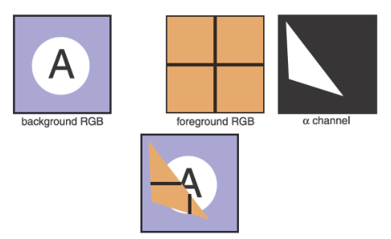

# 阿尔法合成

&emsp;&emsp;通常情况下，我们只想部分地覆盖一个像素的内容。一个典型的例子发生在合成中，我们有一个背景，想在上面插入一个前景图像。对于前景中不透明的像素，我们只需替换背景像素。对于完全透明的前景像素，我们不改变背景像素。对于部分透明的像素，必须小心谨慎。当前景物体有部分透明区域时，如玻璃，就会出现部分透明像素。但是，前景和背景必须混合的最常见的情况是，前景物体只覆盖了部分像素，要么是在前景物体的边缘，要么是有子像素孔，如远处的树叶之间。

&emsp;&emsp;如果我们想在背景物体上混合一个前景物体，最重要的信息是像素覆盖率（pixel coverage），它告诉我们前景层所覆盖的像素的比例。我们可以称这个分数为\\(\alpha \\)。如果我们想要将一个前景色\\(c_f\\)合成到背景色\\(c_b\\)上，而且被前景覆盖的像素比例是\\(\alpha \\)，那我们就可以用下面这个公式：

\\[
\begin{align}
  c = \alpha c_f + (1 - \alpha )c_b
\end{align}
\\]

&emsp;&emsp;对于一个不透明的前景层，这个公式的解释是前景物体覆盖了像素矩形内的比例为\\(\alpha \\)的区域，而背景物体覆盖了剩余的区域，也就是比例为\\((1-\alpha )\\)的区域。对于透明层（想想在玻璃或描图纸上画的图像，使用半透明的油漆），这个公式的解释是前景层阻挡了从背景透过来的那部分光线（比例为\\((1-\alpha )\\)），并贡献了一部分（比例为\\(\alpha \\)）自己的颜色来替代被移除的部分。图3.14显示了一个使用公式3.2的例子[^1]。

[^1]:由于前景层和背景层的权重相加为1，如果前景层和背景层的颜色相同，颜色就不会改变。

**图3.14：** 上图是一个使用公式3.2的合成示例。前景图像在被放在背景图像之上之前，实际上是被\\(\alpha \\)通道裁剪过的。合成结果显示在底部。

&emsp;&emsp;一个图像中所有像素的\\(\alpha \\)值可能被存储在一个单独的灰度图像中，然后被称为阿尔法遮罩（alpha mask）或透明度遮罩（transparency mask）。或者信息可以被存储为RGB图像中的第四个通道，在这种情况下，它被称为阿尔法通道（alpha channel），因此图像可以被称为RGBA图像。
&emsp;&emsp;对于8位图像，每个像素占32位，这在许多计算机架构中是一个大小方便的数据块。

&emsp;&emsp;尽管公式3.2常被使用，但有一些情况下\\(\alpha \\)会有其他不同的用法。（Porter & Duff，1984）。

## 图像存储

&emsp;&emsp;大多数RGB图像格式的红、绿、蓝三色通道各使用8比特。这样一来，一张100万像素的图像大约需要3兆字节的原始信息。为了减少存储需求，大多数图像格式允许某种压缩。在高层次上，这种压缩是无损(lossless)的或有损(lossy)的。在无损压缩中，没有信息被丢弃，而在有损系统中，一些信息会不可恢复地丢失。流行的图像存储格式包括：

* **jpeg.** 这种有损格式是根据人类视觉系统的阈值来压缩图像块。这种格式对自然图像很有效。
* **tiff.** 这种格式最常用于保存二进制图像或无损压缩的8位或16位RGB，尽管还有许多其他选择。
* **ppm.** 这种非常简单的无损、未压缩的格式最常用于8位RGB图像，尽管还有许多其他选择。
* **png.** 这是一套无损格式，有一套很好的开放源码管理工具。

&emsp;&emsp;由于压缩和变体的原因，为图像编写输入/输出例程可能会涉及到。幸运的是，人们通常可以依靠库中的例程来读写标准文件格式。对于快速、肮脏的应用来说，简单的价值高于效率，一个简单的选择是使用原始的PPM文件，这通常可以简单地通过将存储在内存中的图像的数组转储到一个文件中来编写，并在头部追加适当的头文件。
