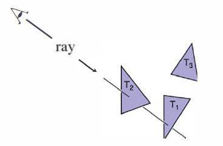

# 基本光线追踪算法

&emsp;&emsp;光线追踪器通过逐像素计算的方式工作，对于每个像素，基本任务是，找出从像素点的位置，被看到的物体。每个像素点“看”的方向不同，任何被像素看到的物体必须与视线相交，视线即从视点朝向像素所看方向发出的一条线。我们想要的特殊物体是与视线相交、距离相机最近的那个物体，因为它挡住了后面其他的物体。找到该物体后，着色计算会使用相交点、表面法向和其他信息（依赖于所需的渲染类型）来决定像素点的颜色。如图4.1所示，射线与两个三角形相交，但只有第一个被光线射中的三角形\\(T_2\\)被着色了。



**图4.1：** 光线被 “追踪 ”到场景中，第一个被击中的物体就是通过像素看到的物体。在这种情况下，是三角形\\(T_2\\)。

&emsp;&emsp;因此，一个光线追踪器包含三个部分：

1. *光线生成*，根据相机的几何形状计算每个像素视线的原点和方向；
2. *光线相交*，找到与视线相交的最近物体；
3. *着色*，基于光线相交结果计算像素颜色。

&emsp;&emsp;光线追踪程序的基本结构是：


```
for each pixel do
    compute viewing ray
    find first object hit by ray and its surface normal n
    set pixel color to value computed from hit point, lights, and n
```

&emsp;&emsp;本章介绍了光线生成、光线相交和着色的基本方法，足以完成一个简单的光线追踪器示例。对于一个真正有用的系统，需要第12章介绍的更高效的光线相交技术；通过第 14 章中更高级的重绘技术，我们将看到光线追踪器的真正潜力。
