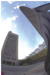
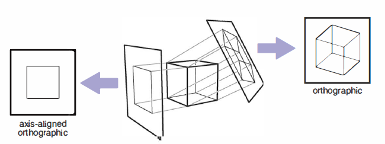
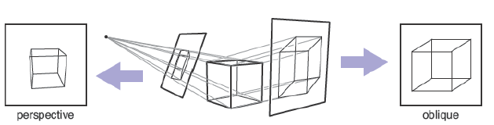
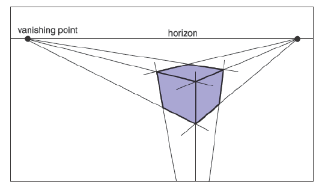

# 透视

&emsp;&emsp;早在计算机出现的几百年前，艺术家们就已经研究过用2D绘图或绘画来表现3D物体或场景的问题。照片也相当于用2D图像表现3D场景。虽然有许多非常规的图像制作方式，例如从立体派绘画到鱼眼镜头（图4.2）再到全景相机，但艺术和摄影以及计算机图形学的标准方法都是线性透视，即把3D物体投影到像平面上，同时保证场景中的直线转换到图像上的直线。

**图4.2：** 使用鱼眼相机的非线性透视图像(*Photo courtesy Philip Greenspun*)。

&emsp;&emsp;最简单的投影方式是平行投影，通过将3D物体沿投影方向移动直到与像平面相遇来实现3D到2D的映射（图4.3-4.4）。生成的视图取决于投影方向和像平面的选择。如果像平面垂直于视线，投影称为*正投影*[^1]；否则，称为*斜投影*。

[^1]:有些书籍将 “正投影 ”用于与坐标轴平行的投影方向。

**图4.3：** 当投影线平行且垂直于像平面时，得到的视图称为正投影视图。

**图4.4：** 像平面与投影方向成一定角度的平行投影称为斜投影（右图）。而在透视投影中，投影线都穿过视点，不是平行的（左图）。图中的透视图是不斜的，因为通过图像中心的投影线是垂直于图像平面的。

&emsp;&emsp;平行投影经常被用来进行机械制图与建筑制图，因为它们能保持平行线的平行，并能保持与图像平面平行的平面物体的大小和形状。

&emsp;&emsp;平行投影的优点也是它的局限。在我们的日常经验中（照片中更是如此），物体远离时看起来更小，因此，向远处退去的平行线看起来并不平行。这是因为眼睛和照相机并非收集单一视向上的光；它们收集穿过特定视点的光。正如文艺复兴时期以来的艺术家们所认识到的，我们可以利用透视投影制作出自然知觉的视图：我们只需沿着经过一个点（即视点）的线进行投影，而不是沿着平行线进行投影（图4.4）。用这样的方式，远离视点的物体被投影时自然变小了。透视视图取决于视点（而非投影方向）和像平面的选择。与平行视图一样，透视视图也有斜投影视图和非斜投影视图之分；区分的依据是图像中心的投影方向。

&emsp;&emsp;你可能已经学习过艺术术语三点透视，它用来手工构建投影视图（图4.5）。一个关于透视的令人惊讶的事实是，如果我们遵循透视所依据的简单数学规则，那么所有透视画法的规则都会自动得到遵循：物体直接投向到眼睛，被绘制在眼睛前的一个像平面上。

**图4.5：** 三点透视中，艺术家选取平行线相交的“消失点”。平行的水平线将相交于水平面上的一个点。每组平行线有自己的消失点。如果我们基于正确的几何原理实现透视，这些规则将被自动遵循。