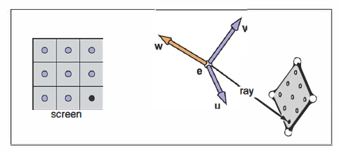
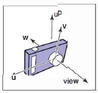
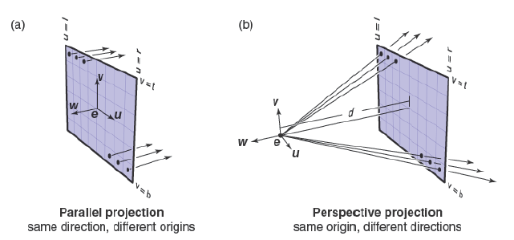

# 计算视线

&emsp;&emsp;根据前面的章节，光线生成的基础工具是视点（或用于平行投影的视向）和像平面。有很多方法可以解决相机几何细节的问题；在本节中，我们介绍一种基于正交基的方法，它支持正交投影、斜平行投影和正平行投影。

&emsp;&emsp;为了生成光线，我们首先需要光线的数学表示。一条光线实际上就是一个原点和一个传播方向；一条3D参数化直线是理想的选择。如章节2.7.7讨论的那样，从眼睛\\(\mathbf{e}\\)发出，穿过像平面上的点\\(\mathbf{s}\\)的3D参数化直线是：

\\[
\mathbf{p}=\mathbf{e}+t(\mathbf{s}-\mathbf{e})
\\]

&emsp;&emsp;这应该被翻译为，“我们从\\(\mathbf{e}\\)出发，沿着向量\\(\(\mathbf{s}-\mathbf{e}\)\\)走过分数距离\\(t\\)找到点\\(\mathbf{p}\\)。”所以给定\\(t\\)，我们能确定点\\(\mathbf{p}\\)。点\\(\mathbf{e}\\)是光线的起点，\\(\(\mathbf{s}-\mathbf{e}\)\\)是光线的方向。

&emsp;&emsp;注意到\\(\mathbf{p}\(0\)=\mathbf{e}\\)，\\(\mathbf{p}\(1\)=\mathbf{s}\\)，而且更一般地说，如果\\(0<t_{1}<t_{2}\\)，那么\\(\mathbf{p}\(t_{1}\)\\)比\\(\mathbf{p}\(t_{2}\)\\)更接近眼睛；而且，若\\(t<0\\)，则\\(\mathbf{p}\(t\)\\)位于眼睛“后面”。这些事实在我们研究被光线击中的最接近眼睛且不在眼睛后面的物体是哪个时特别有用。

&emsp;&emsp;在代码中，光线总是使用某种结构体或者对象来存储位置和方向。例如，在一个面向对象程序中，我们可以这样写：

```
class Ray
    Vec3 o | ray origin
    Vec3 d | ray direction
    Vec3 evalute(real t)
        return o + td
```

我们假定有一个叫Vec3的类，用来表示三维向量，同时支持常见的算数运算符。

&emsp;&emsp;为了计算一条视线，我们需要知道\\(\mathbf{e}\\)（给定的）和\\(\mathbf{s}\\)。寻找\\(\mathbf{s}\\)可能有些困难，但是如果我们在一个直角坐标系中看这个问题，结果十分直截了当。



**图4.7：**屏幕上的采样点被映射到3D窗口上的类似阵列中。这些采样点的每一个位置都会发射一条视线。

&emsp;&emsp;我们的光线生成方法都是从正交坐标系（即相机坐标系，图4.7）开始的。我们将用\\(\mathbf{e}\\)表示眼睛点或视点，用\\(\mathbf{u}\\)，\\(\mathbf{v}\\)，\\(\mathbf{w}\\)表示三个基向量，同时令\\(\mathbf{u}\\)指向右（顺着相机视角），\\(\mathbf{v}\\)指向上，\\(\mathbf{w}\\)指向后面，因而\\(\lbrace \mathbf{u},\mathbf{v},\mathbf{w}\rbrace \\)构成右手坐标系。构建相机坐标系最常用的方法是根据视点（即\\(\mathbf{e}\\)）、视方向（即\\(-\mathbf{w}\\)）和位于\\(\mathbf{v}\\)和\\(\mathbf{w}\\)所在平面的\\(\mathbf{up}\\)向量，具体方法请参见第2.4.7节中所述的从两个向量构建正交基的过程[^1]（图4.8）。

[^1]: \\(\mathbf{v}\\)和\\(\mathbf{w}\\)一定是垂直的，所以通常\\(\mathbf{up}\\)和\\(\mathbf{v}\\)不相同。但是，将向\\(\mathbf{up}\\)向量设置为在场景中笔直向上，就会以我们认为的 “右上 ”方式确定相机的方向。



**图4.8：** 相机坐标系的相关向量和视方向与上方向。\\(\mathbf{w}\\)向量与视方向相反，\\(\mathbf{v}\\)与\\(\mathbf{w}\\)向量和\\(\mathbf{up}\\)向量共平面。

## 正投影视图

&emsp;&emsp;在正投影视图中，所有的光线的方向都是\\(-\mathbf{w}\\)。尽管平行投影没有视点，我们仍然使用相机坐标系的原点来定义光线的起始平面，因而在这种情况下，物体也可能处于相机后面。

&emsp;&emsp;视线从点\\(\mathbf{e}\\)和向量\\(\mathbf{u}\\)、\\(\mathbf{v}\\)定义的平面发出；剩下唯一需要的信息就是图像应处于平面的哪个位置。我们用图像四个边关联的四个数来定义图像的维度：\\(l\\)和\\(r\\)是图像的左和右位置，从\\(\mathbf{e}\\)出发沿\\(\mathbf{u}\\)方向测量得到；\\(b\\)和\\(t\\)是图像的下和上位置，从\\(\mathbf{e}\\)出发沿\\(\mathbf{v}\\)方向测量得到。
通常，\\(l<0<r\\)且\\(b<0<t\\)（图4.9a）。



**图4.9：** 使用相机坐标系的光线生成。(a) 在正投影视图中，光线从位于像平面上的像素点发出，所有的光线的方向和视方向一致。(b) 在透视投影视图中，光线从视点发出，每条光线的方向由视点\\(\mathbf{e}\\)和像平面上像素点的位置定义。[^1]
[^1]: 按理说，正投影光线应该从无限远的地方开始，但这样就无法对房间内的物体进行正投影视图观察了。

&emsp;&emsp;在3.2节中，我们讨论了图像坐标系中的像素。为了将一个有\\(n_{x}\times n_{y}\\)个像素的图像放入大小为\\(\(r-l\)\times\(t-b\)\\)的长方形中，像素的水平间距为\\(\(r-l\)/n_{x}\\)，垂直间距为\\(\(t-b\)/n_{y}\\)，边缘留下半个像素间距来将像素网格放置到图像长方形的中心中[^2][^3]。这意味着光栅图像上位置\\(\(i,j\)\\)的像素点的坐标是：

\\(\begin{array}{c}{{u=l+(r-l)(i+0.5)/n_{x},}}\\\\ {{v=b+(t-b)(j+0.5)/n_{y},}}\end{array}\qquad\qquad\qquad(4.1)\\)

其中\\((u,v)\\)是像素在像平面上的位置坐标，相对原点\\(\mathbf{e}\\)和坐标轴\\(\lbrace \mathbf{u},\mathbf{v} \\rbrace\\)而言。

[^2]: 很多系统假定\\(l=-r\\)和\\(b=-t\\)，这样有一个宽度和高度就足够了。

[^3]: 如果同时指定\\(l\\)和\\(r\\)将会产生冗余：将视点向右平移，并相应地减小\\(l\\)和\\(r\\)，将不会改变视图（\\(\mathbf{v}\\)轴也是如此）

&emsp;&emsp;在正投影视图中，我们可以简单的将像素的像平面位置作为光线的起点，而且我们早就清楚光线的方向就是视方向。这样生成正投影视图的光线的程序可以写为：

1. compute \\(u\\) and \\(v\\) using (4.1)
2. ray.\\(\mathbf{o}\leftarrow\mathbf{e}+u\mathbf{u}+v\mathbf{v}\\)
3. ray.\\(\mathbf{d}\leftarrow -\mathbf{w}\\)

&emsp;&emsp;创建一个斜平行投影视图非常简单：只要分别指定像平面法向量\\(\mathbf{w}\\)和视方向\\(\mathbf{d}\\)。程序完全一致，除了\\(\mathbf{d}\\)不再是\\(-\mathbf{w}\\)。当然，\\(\mathbf{w}\\)仍然被用来构建\\(\mathbf{u}\\)和\\(\mathbf{v}\\)。

## 透视投影视图

&emsp;&emsp;对透视投影视图而言，所有的光线将视点作为相同的起点；对应每个像素的方向是不同的。像平面不再被放置到\\(\mathbf{e}\\)，而是放置在\\(\mathbf{e}\\)前的距离为\\(d\\)处；这个距离是像平面距离，经常被粗略地称为焦距，因为\\(d\\)和真正的相机的焦距扮演了相同的角色。每条光线的方向通过视点以及像素在像平面上的位置定义。图4.9举例说明了这种情况，由此产生的程序与正投影程序类似：

1. compute \\(u\\) and \\(v\\) using (4.1)
2. ray.\\(\mathbf{o}\leftarrow\mathbf{e}\\)
3. ray.\\(\mathbf{d}\leftarrow -d\mathbf{w}+u\mathbf{u}+v\mathbf{v}\\)

&emsp;&emsp;与平行投影一样，通过分别指定像平面法向量和投影方向，也可以实现斜透视图。